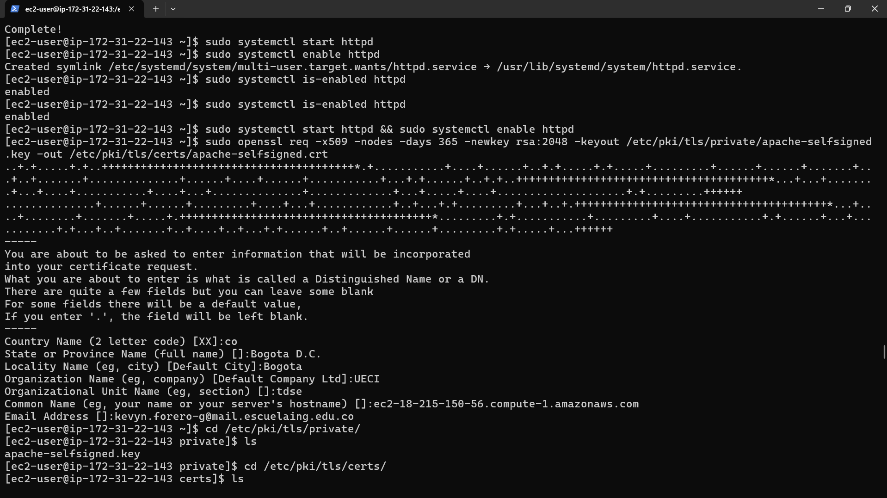
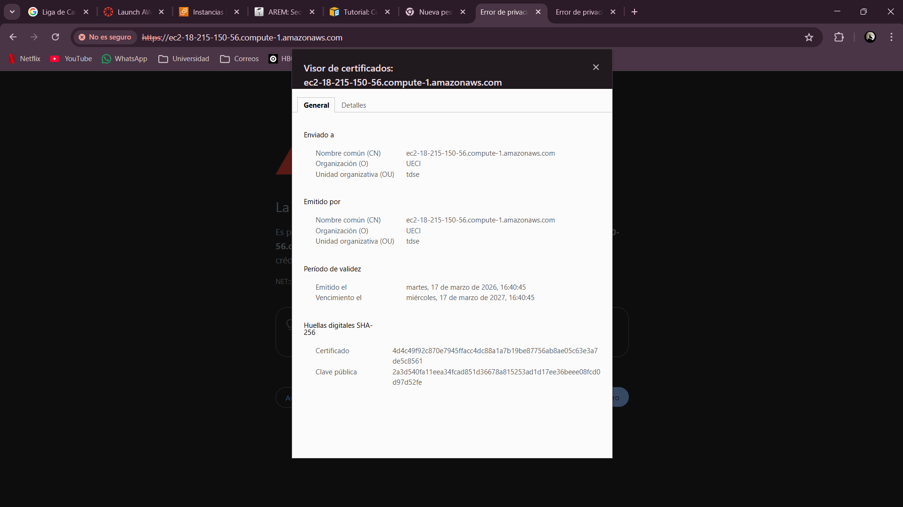
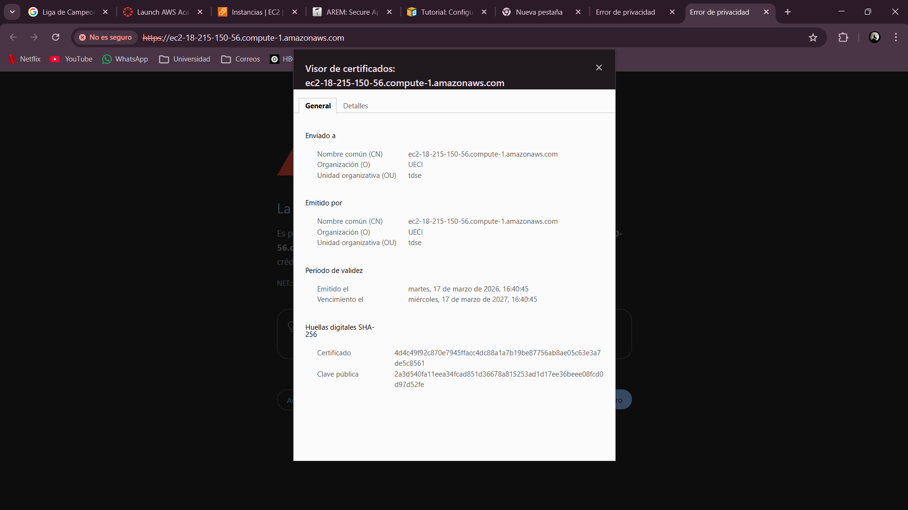
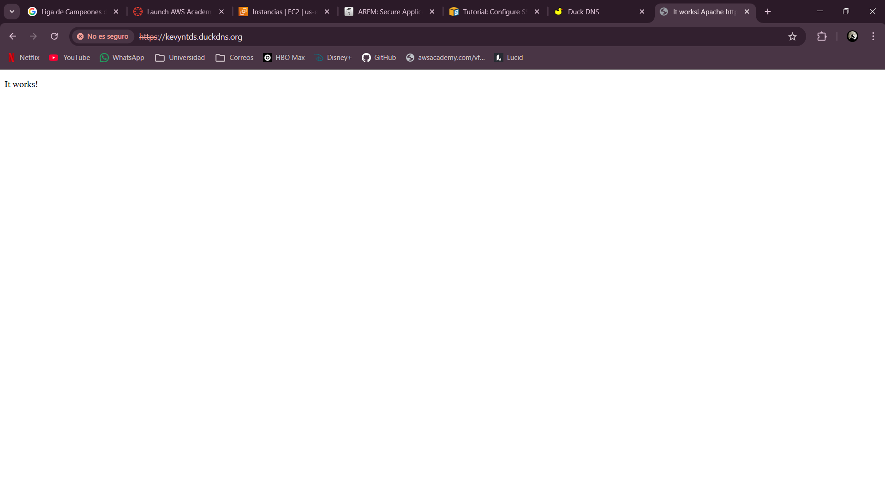

# Taller: Aplicaciones Seguras en AWS

Despliegue de una aplicación web segura con dos servidores independientes en AWS: un servidor **Apache** que sirve el frontend HTML+JS con HTTPS, y un backend **Spring Boot** que expone una API REST también protegida con TLS y autenticación.


---

## Arquitectura General

```
[Navegador del Usuario]
         |
         | HTTPS → kevynapache.duckdns.org
         v
[EC2: ApacheWebService]
  Sirve el frontend estático (HTML + JS)
         |
         | fetch() asíncrono HTTPS → puerto 8443
         v
[EC2: SprintWebServer]
  API REST con Spring Boot
  kevynspring.duckdns.org:8443
```

---

## Características de Seguridad

| Característica | Detalle |
|---|---|
| Cifrado en tránsito | TLS/HTTPS en ambos servidores |
| Certificados | Let's Encrypt via Certbot (renovación automática) |
| Autenticación | Spring Security con usuario y contraseña |
| Contraseñas | Almacenadas como hashes (BCrypt) |
| Comunicación cliente-API | `fetch()` asíncrono con CORS configurado |

---

## Servidor Apache (Frontend)

### Conexión SSH e instalación inicial

La conexión al servidor se realizó desde Windows vía PowerShell usando la clave `.pem` de AWS. Tras conectarse, se actualizó el sistema y se instalaron Apache y PHP.

```bash
ssh -i "AppServer.pem" ec2-user@<IP_EC2>
sudo dnf upgrade -y
sudo dnf install -y httpd wget php-fpm php-mysqli php-json php php-devel
```


### Verificación del servidor

Una vez activo el servicio, Apache respondió correctamente desde la IP pública de la instancia y desde el dominio Duck DNS configurado.


### Certificado autofirmado (paso previo a Let's Encrypt)

Antes de usar Let's Encrypt, se generó un certificado autofirmado con OpenSSL para verificar el funcionamiento de HTTPS en la instancia.

```bash
sudo openssl req -x509 -nodes -days 365 -newkey rsa:2048 \
  -keyout /etc/pki/tls/private/apache-selfsigned.key \
  -out /etc/pki/tls/certs/apache-selfsigned.crt
```





El navegador muestra el certificado con los datos de organización UECI / tdse, válido desde el 17 de marzo de 2026:




### HTTPS con Let's Encrypt (certificado de confianza)

```bash
sudo dnf install certbot python3-certbot-apache -y
sudo nano /etc/httpd/conf.d/kevyntds.conf
sudo apachectl configtest
sudo systemctl restart httpd
sudo certbot --apache
```

Certbot detectó el dominio `kevyntds.duckdns.org` y emitió el certificado exitosamente, desplegándolo en `/etc/httpd/conf.d/kevyntds-le-ssl.conf`:


Apache ahora sirve con HTTPS y el certificado es reconocido como válido por el navegador:


---

## Servidor Spring Boot (Backend)

### Configuración del proyecto

El proyecto fue creado con **Spring Initializr** con las dependencias: Spring Web, Spring Security, Spring Data JPA y H2 Database. El archivo `application.properties` configura el puerto 8443 y el keystore PKCS12 para TLS:

```properties
server.port=8443
server.ssl.key-store=/home/ec2-user/keystore.p12
server.ssl.key-store-password=changeit
server.ssl.key-store-type=PKCS12
server.ssl.key-alias=tomcat
spring.datasource.url=jdbc:h2:mem:testdb
spring.datasource.driver-class-name=org.h2.Driver
spring.jpa.database-platform=org.hibernate.dialect.H2Dialect
```

La compilación se realizó desde IntelliJ IDEA con Maven:


### Compilar y desplegar en EC2

```bash
# En máquina local
.\mvnw.cmd clean package -DskipTests

# Subir al servidor
scp -i "AppServer.pem" target/demo-0.0.1-SNAPSHOT.jar ec2-user@<IP>:~

# Ejecutar en segundo plano
nohup java -jar demo-0.0.1-SNAPSHOT.jar > spring.log 2>&1 &
```

### Certificado TLS para Spring Boot

```bash
sudo certbot certonly --standalone -d kevynspring.duckdns.org

sudo openssl pkcs12 -export \
  -in /etc/letsencrypt/live/kevynspring.duckdns.org/fullchain.pem \
  -inkey /etc/letsencrypt/live/kevynspring.duckdns.org/privkey.pem \
  -out /home/ec2-user/keystore.p12 -name tomcat -passout pass:changeit

sudo chmod 644 /home/ec2-user/keystore.p12
```

Con el keystore instalado, Spring Boot levanta en el puerto 8443 y Spring Security protege los endpoints. El formulario de login es accesible con certificado válido:


---

## Cliente HTML + JavaScript

El cliente se sirve desde Apache en `kevynapache.duckdns.org` y realiza peticiones asíncronas al backend Spring Boot usando `fetch()`:

```javascript
async function login() {
    const response = await fetch('https://kevynspring.duckdns.org:8443/api/login', {
        method: 'POST',
        headers: { 'Content-Type': 'application/json' },
        body: JSON.stringify({ username, password })
    });
    const data = await response.json();
}
```

El formulario HTML sirve desde Apache con campos en español (Usuario / Contraseña):


El dominio de Apache también cuenta con certificado Let's Encrypt válido:


Al ingresar las credenciales correctas, el cliente recibe la respuesta del backend y confirma el acceso:


---

## URLs y Credenciales

| Servicio | URL |
|---|---|
| Frontend (Apache) | https://kevynapache.duckdns.org |
| API REST (Spring Boot) | https://kevynspring.duckdns.org:8443 |

**Credenciales de prueba:**

| Campo | Valor |
|---|---|
| Usuario | admin |
| Contraseña | 1234 |

---
Autor: Kevyn Forero
> Taller de Arquitectura Empresarial — Escuela Colombiana de Ingeniería
